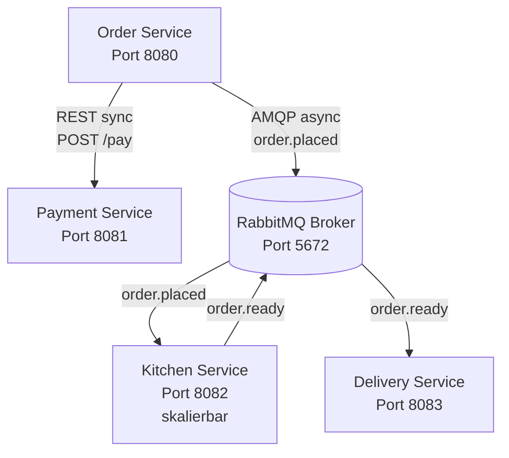

# Distributed Pizza Platform

[](https://github.com/simonstreuli/321-monorepo/actions/workflows/integration-test.yml)

## Projektübersicht

Dieses Projekt implementiert eine verteilte Plattform für einen Pizza-Lieferdienst mit vier unabhängigen Microservices, die über REST und RabbitMQ kommunizieren. Das System demonstriert moderne Microservice-Patterns wie asynchrone Kommunikation, Resilience und horizontale Skalierung.

## 🎤 Präsentation

Für Präsentationen stehen umfassende Präsentations-Dateien zur Verfügung:

- **[PRESENTATION.md](PRESENTATION.md)** – Vollständige Präsentation im Markdown-Format
- **[PRESENTATION_SLIDES.md](PRESENTATION_SLIDES.md)** – Folien-Format (Marp) für Live-Präsentationen
- **[PRESENTATION_README.md](PRESENTATION_README.md)** – Anleitung zur Verwendung der Präsentationen

Die Präsentationen decken alle Aspekte des Projekts ab: Architektur, Team, Technologien, Demo-Szenarien, und Best Practices.

## Team & Zuständigkeiten

| Name  | Rolle                                            | Service                                                                         |
| ----- | ------------------------------------------------ | ------------------------------------------------------------------------------- |
| Simon | Einstiegspunkt, Validierung & Event-Publishing   | [Order Service](/order-service/)                                                |
| Noris | Synchroner Zahlungsabwickler & Fehler-Simulation | [Payment Service](/payment-service/)                                            |
| Fran  | Asynchrone Zubereitung & Skalierung              | [Kitchen Service](/kitchen-service/)                                            |
| Mouad | Event-Konsumierung & Status-Tracking             | [Delivery Service](https://github.com/MouadBourbian/Modul-321-Delivery-Service) |

## Architektur



## Services

### Pizza Models Library

Zentrale Bibliothek für alle gemeinsamen Datenmodelle. Verhindert Duplikation und stellt sicher, dass alle Services dieselben Model-Definitionen verwenden.

**Vorteile:**
- **Konsistenz:** Alle Services nutzen exakt dieselben Model-Definitionen
- **Wartbarkeit:** Änderungen an Modellen werden zentral vorgenommen
- **Type Safety:** Compile-Time-Fehler bei inkompatiblen Model-Versionen
- **Automatische Updates:** Producer-Änderungen werden automatisch an Consumer weitergegeben

**Enthaltene Modelle:** OrderRequest, OrderResponse, OrderPlacedEvent, OrderReadyEvent, PaymentRequest, PaymentResponse

**Dokumentation:** [pizza-models/README.md](/pizza-models/README.md)

### 1. Order Service (Port 8080)

Einstiegspunkt für Bestellungen mit REST API `POST /orders`. Validiert Eingabedaten, kommuniziert synchron mit Payment Service und asynchron mit Kitchen Service via RabbitMQ.

**Technologie:** Java 21, Spring Boot, Spring AMQP

### 2. Payment Service (Port 8081)

Zahlungsabwicklung mit REST API `POST /pay`. Simuliert Zahlungsverarbeitung mit Verzögerungen und zufälligen Fehlern (20% Rate) für Resilience-Testing.

**Technologie:** Java 21, Spring Boot

### 3. Kitchen Service (Port 8082)

Konsumiert `order.placed` Events, simuliert Zubereitungszeit (5-10 Sekunden) und veröffentlicht `order.ready` Events. Horizontal skalierbar durch Competing Consumers Pattern.

**Technologie:** Java 21, Spring Boot, Spring AMQP

### 4. Delivery Service (Port 8083)

Konsumiert `order.ready` Events, weist Fahrer zu und bietet REST API für Statusabfragen (`GET /deliveries/{orderId}`, `GET /deliveries`). Benachrichtigungen via Logs.

**Technologie:** Java 21, Spring Boot, Spring AMQP

### 5. Frontend (Port 3000)

Web-Interface für Bestellungen mit Echtzeit-Anzeige von Status, aktiven Lieferungen und Live-Statistiken.

**Technologie:** Node.js 18, Express.js, Vanilla JavaScript

## Voraussetzungen

- **Docker & Docker Compose**

## Installation und Start

### Mit Docker Compose (empfohlen)

```bash
docker compose up --build
```

Frontend: http://localhost:3000

Mehrere Kitchen Service Instanzen (für Skalierungstests):

```bash
docker compose up --build --scale kitchen-service=3
```

## Zugriff auf die Dienste

Nach dem Start sind folgende Dienste verfügbar:

- **Frontend:** http://localhost:3000 – Web-Interface für Bestellungen
- **Order Service:** http://localhost:8080 – REST API
- **Payment Service:** http://localhost:8081 – REST API
- **Kitchen Service:** http://localhost:8082 – Asynchron via RabbitMQ
- **Delivery Service:** http://localhost:8083 – REST API
- **RabbitMQ Management:** http://localhost:15672 – Admin UI (guest/guest)

## API Contracts

### POST /orders

Request:

```json
{
  "pizza": "Margherita",
  "quantity": 2,
  "address": "Musterstrasse 123, 8000 Zürich",
  "customerName": "Max Mustermann"
}
```

Response:

```json
{
  "orderId": "123e4567-e89b-12d3-a456-426614174000",
  "status": "SUCCESS",
  "message": "Order placed successfully!"
}
```

### POST /pay

Request:

```json
{
  "orderId": "123e4567-e89b-12d3-a456-426614174000",
  "customerName": "Max Mustermann",
  "amount": 31.98
}
```

Response:

```json
{
  "transactionId": "987fcdeb-51a2-43d7-b543-123456789abc",
  "success": true,
  "message": "Payment processed successfully"
}
```

### RabbitMQ Messages

**order.placed:**

```json
{
  "orderId": "123e4567-e89b-12d3-a456-426614174000",
  "pizza": "Margherita",
  "quantity": 2,
  "address": "Musterstrasse 123, 8000 Zürich",
  "customerName": "Max Mustermann",
  "timestamp": "2026-01-09T10:30:00"
}
```

**order.ready:**

```json
{
  "orderId": "123e4567-e89b-12d3-a456-426614174000",
  "pizza": "Margherita",
  "quantity": 2,
  "preparedAt": "2026-01-09T10:35:00"
}
```

## Testing Szenarien

### Mit Frontend

1. System starten: `docker compose up --build`
2. Frontend öffnen: http://localhost:3000
3. Bestellung aufgeben und Status beobachten

### Via API

**Erfolgreiche Bestellung:**

```bash
curl -X POST http://localhost:8080/orders \
  -H "Content-Type: application/json" \
  -d '{"pizza": "Margherita", "quantity": 2, "address": "Musterstrasse 123", "customerName": "Max Mustermann"}'
```

**Resilience: Payment Service offline**

```bash
docker compose stop payment-service
curl -X POST http://localhost:8080/orders -H "Content-Type: application/json" -d '{"pizza": "Margherita", "quantity": 1, "address": "Test", "customerName": "User"}'
docker compose start payment-service
```

**Pufferung: Kitchen Service offline**

```bash
docker compose stop kitchen-service

for i in {1..5}; do
  curl -X POST http://localhost:8080/orders \
    -H "Content-Type: application/json" \
    -d "{\"pizza\": \"Margherita\", \"quantity\": 1, \"address\": \"Test $i\", \"customerName\": \"User $i\"}"
done

docker compose start kitchen-service
docker compose logs -f kitchen-service
```

**Skalierung: Mehrere Kitchen Instanzen**

```bash
docker compose up --scale kitchen-service=3 -d

for i in {1..10}; do
  curl -X POST http://localhost:8080/orders \
    -H "Content-Type: application/json" \
    -d "{\"pizza\": \"Margherita\", \"quantity\": 1, \"address\": \"Test $i\", \"customerName\": \"User $i\"}"
done

docker compose logs kitchen-service | grep "Received order"
```

## Integration Tests

Das Projekt verfügt über umfassende End-to-End Integration Tests, die das gesamte System validieren.

### Automatische Tests

Die Integration Tests laufen automatisch:
- Bei jedem Push zu `main` oder `develop`
- Bei jedem Pull Request
- Täglich um 2:00 UTC (geplante Ausführung)

**Status:** Siehe Badge oben im README

### Lokale Ausführung

```bash
# Integration Tests ausführen
./integration-test.sh
```

Der Test Script:
1. Startet alle Services mit Docker Compose
2. Wartet auf Health Checks aller Services
3. Führt End-to-End Tests durch (Bestellungen, Message Flow, etc.)
4. Räumt automatisch auf

**Dokumentation:** [INTEGRATION_TESTS.md](INTEGRATION_TESTS.md)

## Hochverfügbarkeit (HA) Features

- **Asynchrone Kommunikation:** Bestellungen werden in RabbitMQ gepuffert (Durable Queues)
- **Fehlerbehandlung:** Graceful Degradation bei Service-Ausfall, konfigurierbare Timeouts
- **Skalierung:** Competing Consumers Pattern mit Load Balancing
- **Monitoring:** Health Endpoints, Structured Logging, RabbitMQ Management UI (http://localhost:15672)
