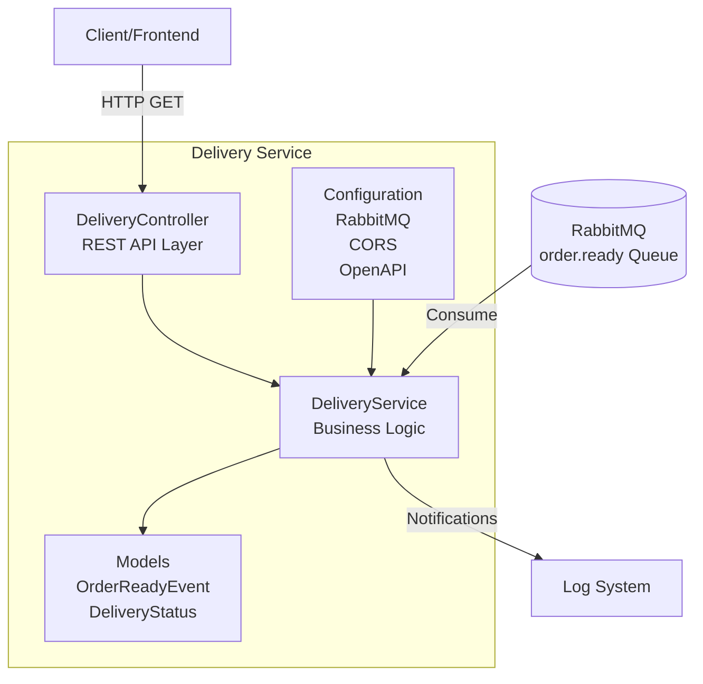
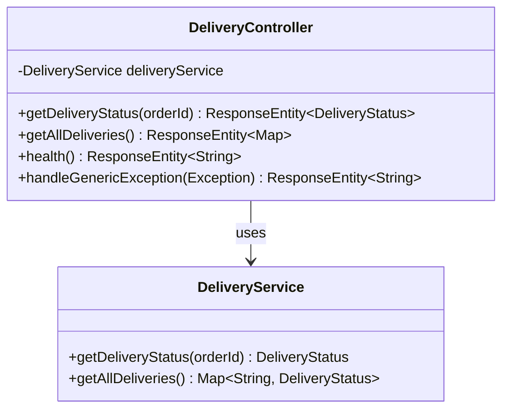
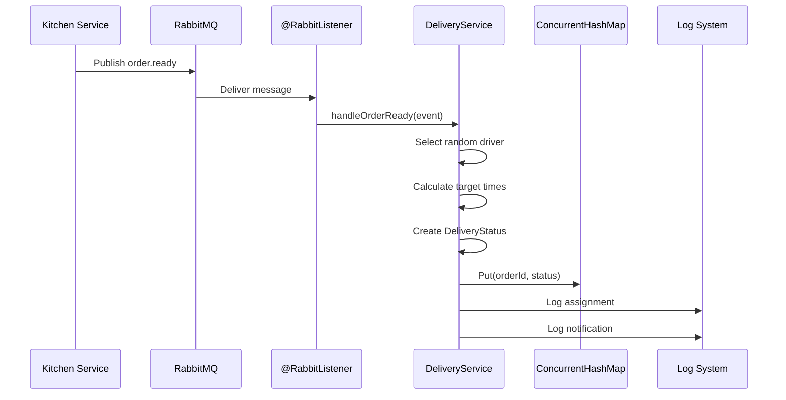
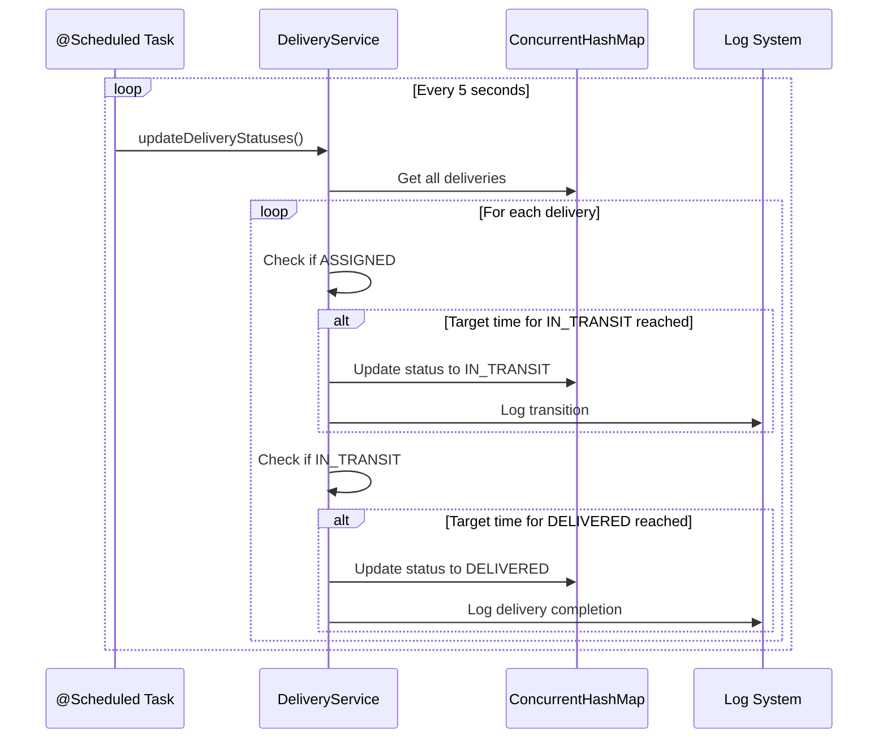
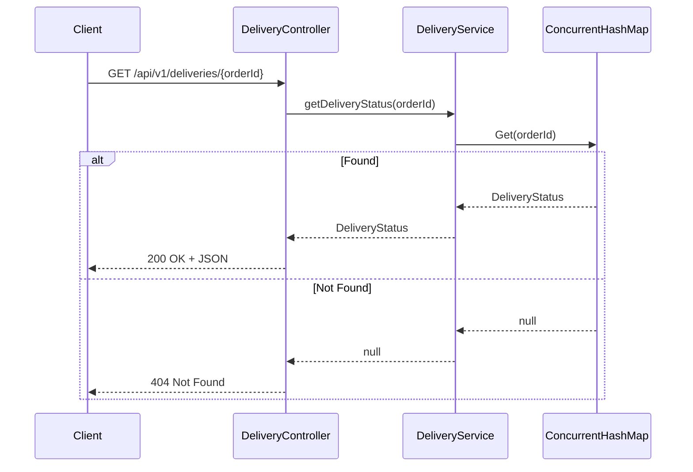
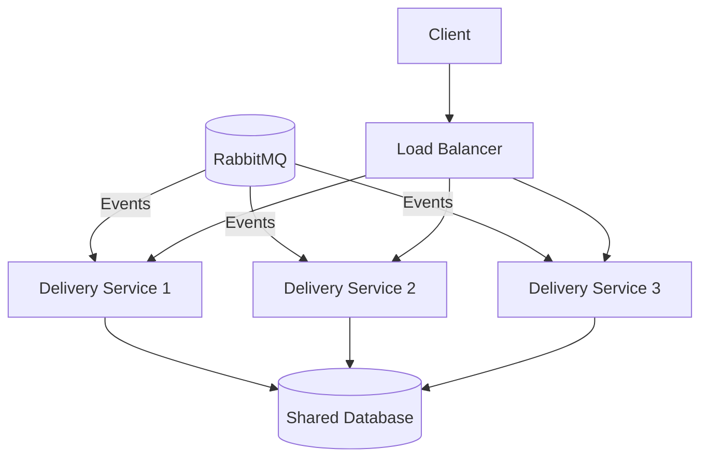
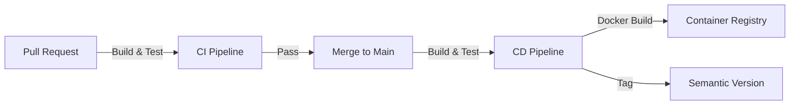

# Architecture Documentation - Delivery Service

Technical architecture documentation for the Delivery Service, part of the Distributed Pizza Platform. This document describes design decisions, patterns, components, and technical implementation details.

## Table of Contents

- [Architecture Overview](#architecture-overview)
- [Component Architecture](#component-architecture)
- [Data Flow and Sequences](#data-flow-and-sequences)
- [Design Patterns and Practices](#design-patterns-and-practices)
- [Technology Stack](#technology-stack)
- [Data Management](#data-management)
- [Performance and Scaling](#performance-and-scaling)
- [Resilience and Error Handling](#resilience-and-error-handling)
- [Testing Strategy](#testing-strategy)
- [Deployment Architecture](#deployment-architecture)

## Architecture Overview

The Delivery Service is an event-driven microservice that relies on asynchronous communication and provides a RESTful API for status queries.

### High-Level Architecture



### Architecture Principles

1. **Event-Driven Architecture**: Asynchronous processing of Kitchen events
2. **Separation of Concerns**: Clear separation between Controller, Service, and Models
3. **Dependency Injection**: Spring IoC Container for loose coupling
4. **Stateless Service**: No persistent data storage (in-memory)
5. **Scheduled Processing**: Automatic status updates via scheduler
6. **RESTful API Design**: Standard HTTP methods and status codes
7. **API Versioning**: All endpoints prefixed with `/api/v1/` for compatibility

---

## Component Architecture

### Controller Layer

**Class**: `DeliveryController`

**Responsibilities**:

- HTTP request handling
- Path variable validation
- Response mapping
- Exception handling
- OpenAPI documentation annotations



**REST Mappings**:

- `GET /api/v1/deliveries/{orderId}` - Get specific delivery status
- `GET /api/v1/deliveries` - Get all deliveries
- `GET /api/v1/deliveries/health` - Health check

### Service Layer

**Class**: `DeliveryService`

**Responsibilities**:

- Event consumption (RabbitMQ)
- Business logic
- Driver assignment
- Status management
- Scheduled status updates
- Customer notifications

```java
@Service
public class DeliveryService {
    // In-Memory Storage
    private final Map<String, DeliveryStatus> deliveries = new ConcurrentHashMap<>();

    // Event Handler
    @RabbitListener(queues = RabbitMQConfig.ORDER_READY_QUEUE)
    public void handleOrderReady(OrderReadyEvent event) { ... }

    // Scheduled Task
    @Scheduled(fixedRate = 5000)
    public void updateDeliveryStatuses() { ... }

    // Query Methods
    public DeliveryStatus getDeliveryStatus(String orderId) { ... }
    public Map<String, DeliveryStatus> getAllDeliveries() { ... }
}
```

**Key Features**:

- **Thread-Safe**: Uses `ConcurrentHashMap` and `synchronized` blocks
- **Scheduled Execution**: Status updates every 5 seconds
- **Random Assignment**: Driver selection from pool
- **Time-Based Transitions**: Automatic status transitions based on timestamps

### Model Layer

#### DeliveryStatus

**Output model for REST API**:

| Field                 | Type          | Description                            |
| --------------------- | ------------- | -------------------------------------- |
| orderId               | String        | Unique order identifier (UUID)         |
| status                | String        | ASSIGNED, IN_TRANSIT, or DELIVERED     |
| driverName            | String        | Assigned driver name                   |
| address               | String        | Delivery address                       |
| assignedAt            | LocalDateTime | Time of driver assignment              |
| estimatedDeliveryTime | LocalDateTime | Estimated delivery time                |
| deliveredAt           | LocalDateTime | Actual delivery time (nullable)        |
| inTransitAt           | LocalDateTime | Time driver started transit (nullable) |

#### OrderReadyEvent

**Input event from Kitchen Service**:

| Field        | Type          | Description                 |
| ------------ | ------------- | --------------------------- |
| orderId      | String        | Unique order identifier     |
| pizza        | String        | Pizza type                  |
| quantity     | Integer       | Number of pizzas            |
| address      | String        | Delivery address            |
| customerName | String        | Customer name               |
| preparedAt   | LocalDateTime | Preparation completion time |

### Configuration Layer

#### RabbitMQConfig

- **Durable Queue**: Survives broker restarts
- **JSON Message Converter**: Automatic mapping of JSON to Java objects
- **Spring AMQP**: Declarative message handling

#### OpenApiConfig

- **Swagger UI**: Interactive API documentation
- **OpenAPI 3.0**: Standard API specification
- **Server Configuration**: Development server URL

---

## Data Flow and Sequences

### Event Processing Flow



### Scheduled Status Update Flow



### REST API Query Flow



---

## Design Patterns and Practices

### Event-Driven Architecture

**Pattern**: Asynchronous message processing via message broker

**Implementation**:

- `@RabbitListener` for declarative event handling
- Durable queues for persistence
- JSON serialization for message format

**Benefits**:

- Loose coupling between services
- Resilience during service outages
- Scalability through message buffering

### Scheduled Task Pattern

**Pattern**: Time-based background processing

**Implementation**:

```java
@EnableScheduling  // Application level
@Scheduled(fixedRate = 5000)  // Method level
public void updateDeliveryStatuses() { ... }
```

**Benefits**:

- Automatic status transitions
- No manual trigger logic required
- Simple configuration

### Thread-Safety Pattern

**Pattern**: Synchronized blocks with concurrent collections

**Implementation**:

```java
// Concurrent Collection
private final Map<String, DeliveryStatus> deliveries = new ConcurrentHashMap<>();

// Synchronized Block for atomic operations
synchronized (delivery) {
    if ("ASSIGNED".equals(delivery.getStatus())) {
        delivery.setStatus("IN_TRANSIT");
    }
}
```

---

## Technology Stack

| Technology        | Version | Purpose               |
| ----------------- | ------- | --------------------- |
| Java              | 17      | Runtime environment   |
| Spring Boot       | 3.2.1   | Application framework |
| Spring AMQP       | -       | RabbitMQ integration  |
| Spring Web        | -       | REST API              |
| SpringDoc OpenAPI | 2.3.0   | API documentation     |
| Lombok            | -       | Code generation       |
| JaCoCo            | 0.8.11  | Code coverage         |
| Maven             | 3.9+    | Build tool            |

---

## Data Management

### In-Memory Storage

**Structure**:

```java
Map<String, DeliveryStatus> deliveries = new ConcurrentHashMap<>();
```

**Characteristics**:

- **Key**: orderId (String UUID)
- **Value**: DeliveryStatus object
- **Thread-Safe**: ConcurrentHashMap
- **Volatile**: Data is lost on restart

**Scaling Considerations**:

- For production: External database (e.g., PostgreSQL, MongoDB)
- Currently: Suitable for demo and testing

---

## Performance and Scaling

### Performance Characteristics

| Aspect            | Details                           |
| ----------------- | --------------------------------- |
| API Response Time | < 10ms (in-memory lookup)         |
| Event Processing  | Asynchronous, non-blocking        |
| Scheduled Task    | Every 5 seconds, O(n) complexity  |
| Concurrency       | Thread-safe for parallel requests |

### Horizontal Scaling



---

## Resilience and Error Handling

### RabbitMQ Resilience

**Durable Queues**:

```java
new Queue(ORDER_READY_QUEUE, true); // durable = true
```

**Automatic Reconnection**:

- Spring AMQP reconnects automatically on connection loss
- Retry logic for message consumption

### API Error Handling

```java
@ExceptionHandler(Exception.class)
public ResponseEntity<String> handleGenericException(Exception ex) {
    logger.error("Unexpected error: {}", ex.getMessage(), ex);
    return ResponseEntity.internalServerError()
        .body("An unexpected error occurred.");
}
```

---

## Testing Strategy

### Unit Tests

**Coverage Target**: 80% minimum line coverage

**Test Categories**:

- Service layer tests (DeliveryServiceTest)
- Controller layer tests (DeliveryControllerTest)
- Model tests (DeliveryStatusTest, OrderReadyEventTest)
- Configuration tests (RabbitMQConfigTest, OpenApiConfigTest)

### Running Tests

```bash
# Run tests
mvn test

# Run tests with coverage report
mvn test jacoco:report
```

---

## Deployment Architecture

### CI/CD Pipeline


