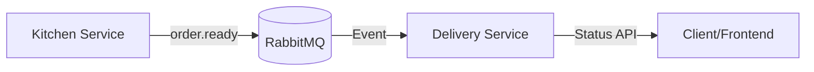

# Delivery Service

> [!IMPORTANT]
> This folder was a temporary solution and is now **read-only**.
> 
> The active development has moved to a dedicated repository: [Modul-321-Delivery-Service](https://github.com/MouadBourbian/Modul-321-Delivery-Service)

[](https://github.com/MouadBourbian/Modul-321-Delivery-Service/actions/workflows/ci-cd.yml)
[](https://opensource.org/licenses/MIT)
[](https://openjdk.org/projects/jdk/17/)
[](https://spring.io/projects/spring-boot)

A microservice for managing pizza deliveries as part of the Distributed Pizza Platform. This service handles delivery assignments, status tracking, and customer notifications through event-driven architecture.

## Table of Contents

- [Overview](#overview)
- [Features](#features)
- [Architecture](#architecture)
- [Quick Start](#quick-start)
- [API Documentation](#api-documentation)
- [Configuration](#configuration)
- [Testing](#testing)
- [Deployment](#deployment)

## Overview

The Delivery Service is responsible for:

- **Event Consumption**: Receives `order.ready` events from the Kitchen Service via RabbitMQ
- **Driver Assignment**: Automatically assigns available drivers to orders
- **Status Tracking**: Tracks deliveries through status transitions (ASSIGNED, IN_TRANSIT, DELIVERED)
- **Customer Notification**: Logs delivery details for customer notification purposes
- **REST API**: Provides endpoints for querying delivery status

### System Context



## Features

| Feature             | Description                                                |
| ------------------- | ---------------------------------------------------------- |
| Event-Driven        | Consumes RabbitMQ messages for asynchronous processing     |
| REST API            | Versioned API (`/api/v1/`) for delivery status queries     |
| Auto Status Updates | Scheduled task updates delivery statuses automatically     |
| Swagger UI          | Interactive API documentation at `/api/v1/swagger-ui.html` |
| Health Checks       | Built-in health endpoint for monitoring                    |
| Docker Support      | Multi-stage Dockerfile for optimized container builds      |

## Architecture

For detailed architecture documentation, see [ARCHITECTURE.md](./ARCHITECTURE.md).

## Quick Start

### Prerequisites

- Java 17 or higher
- Maven 3.9+
- RabbitMQ Server (or Docker)

### Local Development

1. **Start RabbitMQ** (with Docker):

   ```bash
   docker run -d --name rabbitmq -p 5672:5672 -p 15672:15672 rabbitmq:3.12-management
   ```

2. **Build and run the service**:

   ```bash
   mvn clean package
   java -jar target/delivery-service-1.0.0.jar
   ```

3. **Verify the service is running**:
   ```bash
   curl http://localhost:8083/api/v1/deliveries/health
   ```

### Docker Deployment

```bash
# Build the image
docker build -t delivery-service:latest .

# Run the container
docker run -d \
  -p 8083:8083 \
  -e SPRING_RABBITMQ_HOST=rabbitmq \
  --name delivery-service \
  delivery-service:latest
```

## API Documentation

### Base URL

```
http://localhost:8083/api/v1
```

### Interactive Documentation

Swagger UI is available at: `http://localhost:8083/api/v1/swagger-ui.html`

OpenAPI spec is available at: `http://localhost:8083/api/v1/api-docs`

### Endpoints

| Method | Endpoint                       | Description                     |
| ------ | ------------------------------ | ------------------------------- |
| GET    | `/api/v1/deliveries/{orderId}` | Get delivery status by order ID |
| GET    | `/api/v1/deliveries`           | Get all active deliveries       |
| GET    | `/api/v1/deliveries/health`    | Health check endpoint           |

## Configuration

### Application Properties

| Property                   | Description       | Default     |
| -------------------------- | ----------------- | ----------- |
| `server.port`              | HTTP server port  | `8083`      |
| `spring.rabbitmq.host`     | RabbitMQ hostname | `localhost` |
| `spring.rabbitmq.port`     | RabbitMQ port     | `5672`      |
| `spring.rabbitmq.username` | RabbitMQ username | `guest`     |
| `spring.rabbitmq.password` | RabbitMQ password | `guest`     |

### Environment Variables

For Docker deployments, use these environment variables:

```bash
SERVER_PORT=8083
SPRING_RABBITMQ_HOST=rabbitmq
SPRING_RABBITMQ_PORT=5672
SPRING_RABBITMQ_USERNAME=guest
SPRING_RABBITMQ_PASSWORD=guest
```

## Testing

### Run Unit Tests

```bash
mvn test
```

### Run Tests with Coverage Report

```bash
mvn test jacoco:report
```

Coverage reports are generated in `target/site/jacoco/index.html`.

### Test Coverage Requirements

The project enforces a minimum of 80% line coverage through JaCoCo.

## Deployment

### CI/CD Pipeline

The project uses GitHub Actions for continuous integration and deployment:

1. **On Pull Request**: Build and test the application
2. **On Merge to Main**: Build, test, create Docker image, and push to GitHub Container Registry

### Semantic Versioning

The project follows Semantic Versioning (SemVer). Versions are automatically incremented on merge to main.

### Container Registry

Docker images are published to GitHub Container Registry:

```bash
docker pull ghcr.io/mouadbourbian/Modul-321-Delivery-Service:latest
```

## Technology Stack

| Technology        | Version | Purpose               |
| ----------------- | ------- | --------------------- |
| Java              | 17      | Runtime               |
| Spring Boot       | 3.2.1   | Application framework |
| Spring AMQP       | -       | RabbitMQ integration  |
| SpringDoc OpenAPI | 2.3.0   | API documentation     |
| Lombok            | -       | Code generation       |
| JaCoCo            | 0.8.11  | Code coverage         |
| Maven             | 3.9+    | Build tool            |
